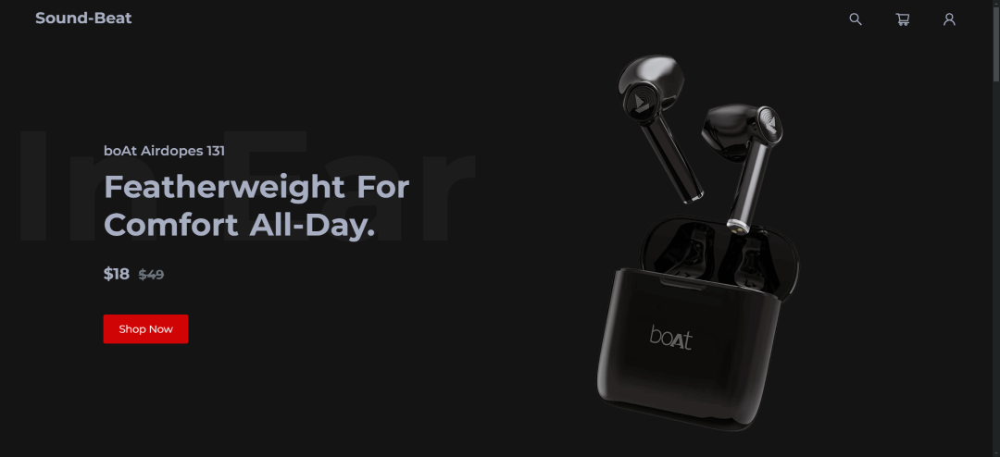
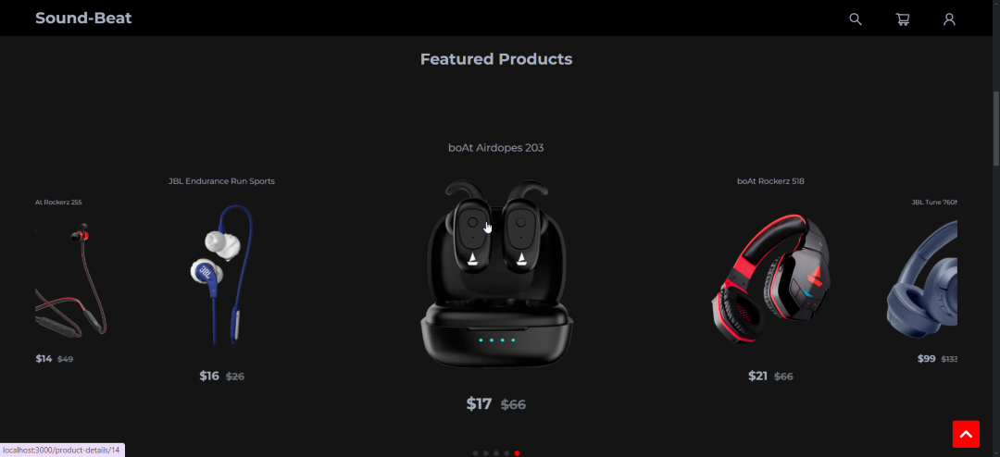
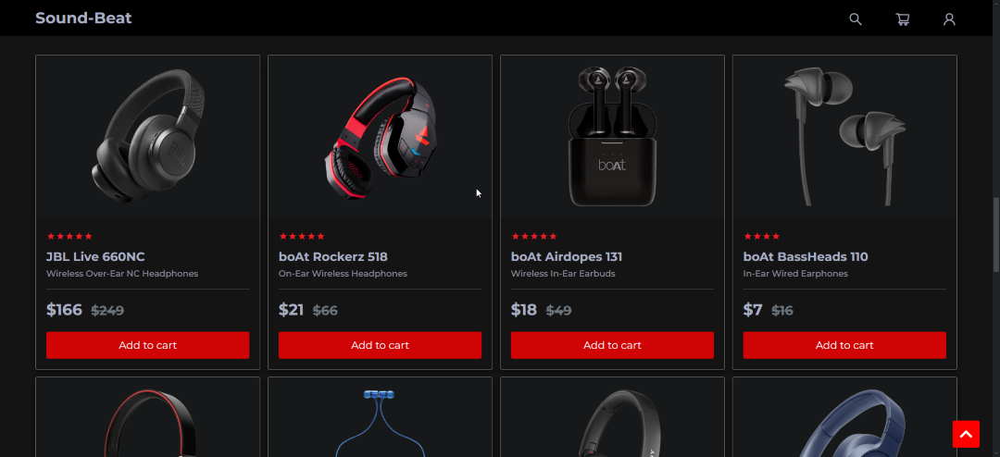
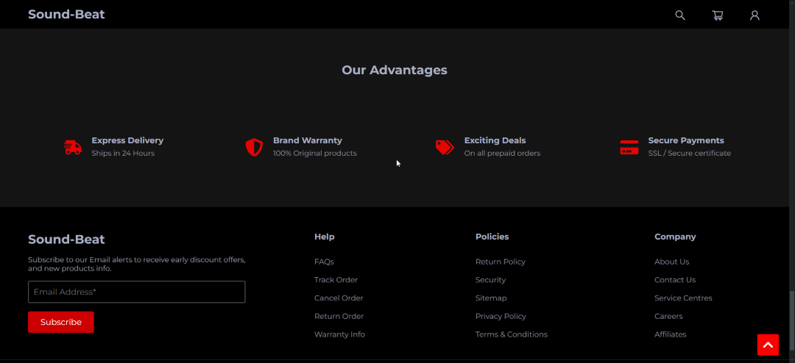
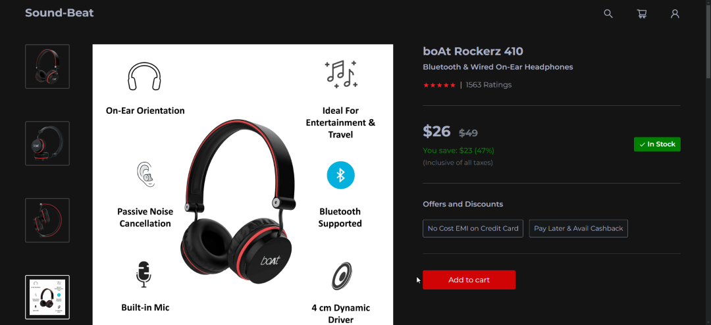

## Sound-Beat | React eCommerce Web App

###
Audio Store eCommerce Website, built with **React JS**.  
State management using Context API.

  
  
  
  
  

 

## Features:

- #### Add Product to the Cart
- #### Remove Product from the Cart
- #### Increment / Decrement the Product's Quantity
- #### Product's Total Price / Discount Calculations
- #### Filters - Sort by / Filter by Options
- #### Custom Hooks
- #### Local Storage
- #### Fully Responsive
- #### Dark Theme
- #### Multi Pages
- #### ...and much more

 

## Technologies used:

- #### **React JS**
- #### **React Router**
- #### **React Swiper**
- #### **SASS**

 

## Author:

- **Chamber** - 

 

## Available Scripts:

#### `npm start`

#### `npm test`

#### `npm run build`

#### `npm run eject`

 

## License:

This project is licensed under the  MIT License- see the [LICENSE](LICENSE.md) file for details.
